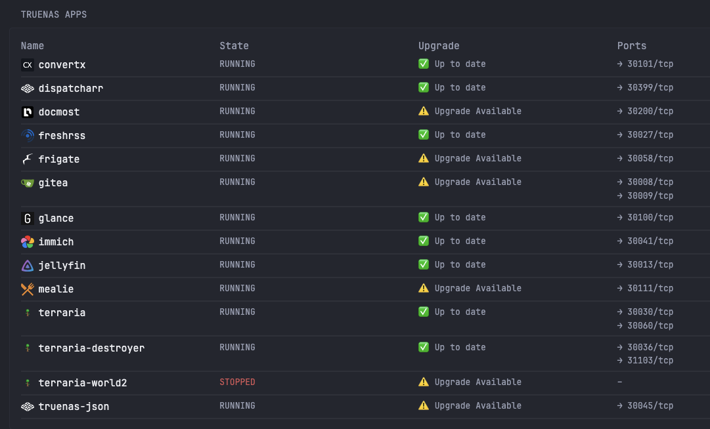

### Glance - TrueNAS Apps

I created this guide so that others could monitor the applications running on their TrueNAS Scale instance via Glance.



This project utilizes the websocket client `midclt`, along with an `nginx` container to host the outputted JSON file for [Glance](https://github.com/glanceapp/glance) to read.

### Shell script configuration

The following shell script should be stored on the TrueNAS Scale device, and scheduled to run via cron.

#### Shell script

I stored my shell script in `/mnt/.ix-apps/app_mounts/truenas_json` and have it named `script.sh`.

```sh
#!/bin/bash

OUTPUT_DIR="/mnt/.ix-apps/app_mounts/truenas_json/json"

midclt call app.query | jq '
  map(
    . as $app |
    $app + {
      dedup_ports: (
        ($app.active_workloads.container_details // [])
        | map(
            .port_config? // []
            | map(
                . as $pc
                | $pc.host_ports? // []
                | map({
                    host_port: .host_port,
                    protocol: $pc.protocol
                })
            )
            | flatten
        )
        | flatten
        | unique_by(.host_port, .protocol)
      )
    }
  )
  | sort_by(.name)
' > "${OUTPUT_DIR}/app.query.json"
```

#### Cron job

In the TrueNAS Scale webui, visit `System > Advanced Settings`.

Under `Cron Jobs`, click `Add`.

```
Description: TrueNAS_JSON
Command: /mnt/.ix-apps/app_mounts/truenas_json/script.sh
Run As User: root
Schedule: Custom
  Minutes: */1
  Hours: *
  Days of Month: *
Hide Standard Output: Checked
Hide Standard Error: Unchecked
Enabled: Checked
```

Click `Save`.

### docker-compose.yaml

```yaml
services:
  jsonserver:
    container_name: truenas-json
    image: nginx:alpine
    ports:
      - '30045:80'
    restart: unless-stopped
    volumes:
      - /mnt/.ix-apps/app_mounts/truenas_json/json/:/usr/share/nginx/html:ro
version: '3.8'
```

### Glance

Glance will need an environment variable added (or you can manually edit the yaml file below)

```
TRUENAS_APPS_URL=http://IP_OR_HOSTNAME:PORT
```

```yaml
- type: custom-api
  title: TrueNAS Apps
  url: ${TRUENAS_APPS_URL}/app.query.json
  cache: 1m
  template: |
  {{ $apps := .JSON.Array "" }}
  <div class="space-y-2">
  	<div class="flex font-semibold border-b border-muted pb-1 mb-2">
  	<div class="flex-1 size-h3">Name</div>
  	<div class="flex-1 size-h3">State</div>
  	<div class="flex-1 size-h3">Upgrade</div>
  	<div class="flex-1 size-h3">Ports</div>
  	</div>
  
  	{{ range $app := $apps }}
  	{{ $upgrade := $app.Bool "upgrade_available" }}
  	<div class="flex text-left items-start space-x-2" style="border-bottom:2px solid #ffffff0d;padding-top:5px;padding-bottom:5px;">
  		<!-- Name + Icon -->
  		<div class="flex-1 flex items-center space-x-2">
  		{{ $icon := $app.String "metadata.icon" }}
  		{{ if $icon }}
  			
  		{{ else }}
  			
  		{{ end }}
  		<span class="font-bold color-highlight size-h3">{{ $app.String "name" }}</span>
  		</div>
  
  		<!-- State -->
  		{{ $state := $app.String "state" }}
  		<div class="flex-1" style="{{ if ne $state "RUNNING" }}color: #d75757;{{ end }}">
  		{{ $state }}
  		</div>
  
  		<!-- Upgrade Status -->
  		<div class="flex-1">
  		{{ if $upgrade }}
  			<span style="/*color: #ff5c5c;font-weight: bold;*/">⚠️ Upgrade Available</span>
  		{{ else }}
  			<span style="/*color: #57b757;"*/>✅ Up to date</span>
  		{{ end }}
  		</div>
  
  		<!-- Ports -->
  		<div class="flex-1 text-sm">
  		{{ if $app.Exists "dedup_ports" }}
  			{{ $ports := $app.Array "dedup_ports" }}
  			{{ if (eq (len $ports) 0) }}
  			<span class="text-muted">–</span>
  			{{ else }}
  			{{ range $port := $ports }}
  				{{ $hp := $port.Int "host_port" }}
  				{{ $proto := $port.String "protocol" }}
  				<div>→ {{ $hp }}/{{ $proto }}</div>
  			{{ end }}
  			{{ end }}
  		{{ else }}
  			<span class="text-muted">–</span>
  		{{ end }}
  		</div>
  	</div>
  	{{ end }}
  </div>
```
